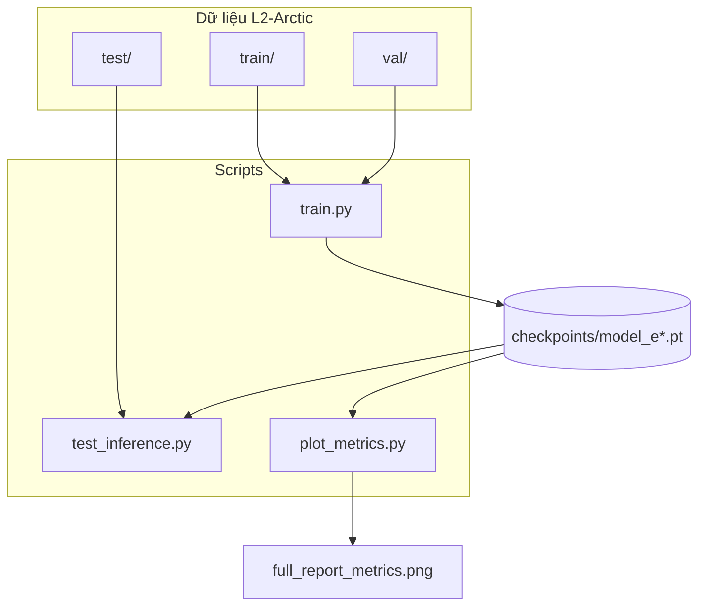
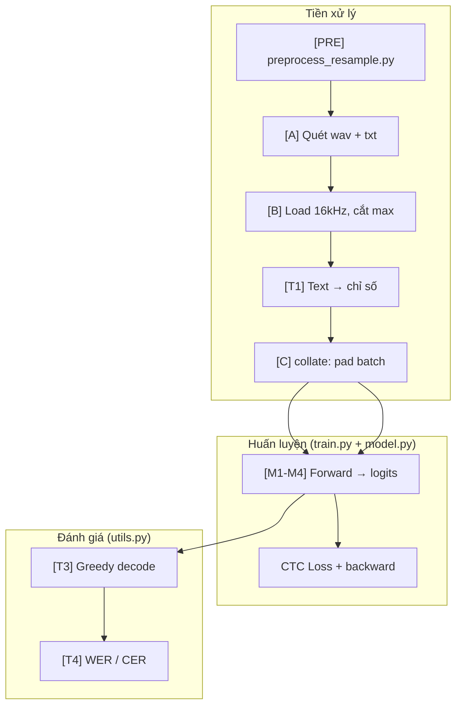
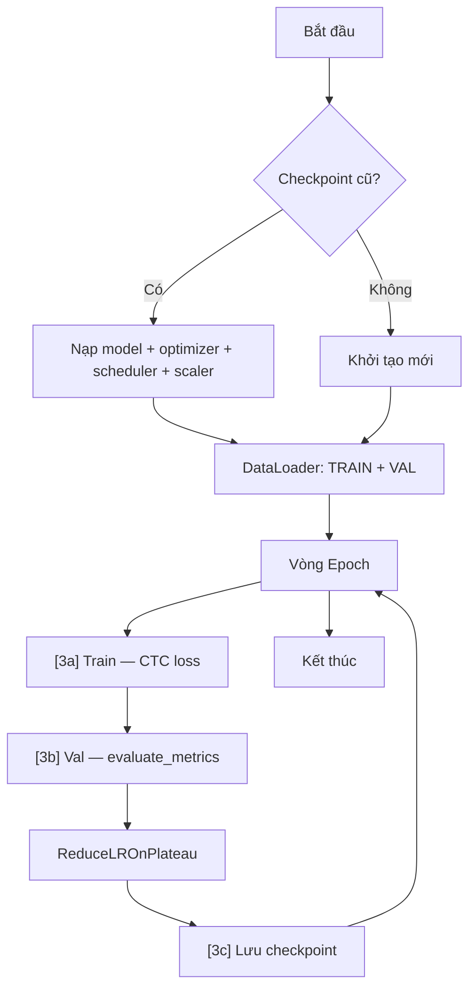
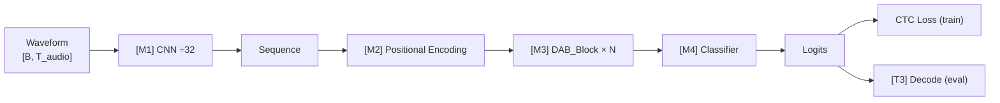

# Sơ đồ luồng — DAB Transformer (ASR + CTC)


## Bảng giai đoạn — tra nhanh “đoạn nào làm gì”


| Mã | Giai đoạn | Khi nào chạy | File / Hàm |

|----|-----------|--------------|------------|

| **0** | Cấu hình | Trước mọi thứ | `config.py` → `Config` |

| **PRE** | **Resample 16 kHz offline** | **1 lần** trước train | `preprocess_resample.py` |

| **A** | Index dữ liệu | 1 lần khi `L2ArcticDataset(...)` | `dataset.py` → `__init__`, `_probe_length` |

| **B** | Load wav 16k + text (không resample) | Mỗi batch | `dataset.py` → `__getitem__` |

| **C** | Gom batch + padding | Sau [B], trước vào GPU | `dataset.py` → `collate_fn` |

| **D** | Sắp batch theo độ dài | Khi tạo DataLoader | `dataset.py` → `BucketBatchSampler` |

| **T1** | Chuẩn hóa text (số→chữ, bỏ dấu) | Trong [B] | `utils.py` → `TextProcess.normalize` |
| **M-aug** | SpecAugment (train only) | Mỗi forward train | `augment.py` → `FeatureSpecAugment` |
| **T3b** | Beam search decode | Val / test | `utils.py` → `ctc_beam_search` |

| **M1–M4** | Trích đặc trưng + Transformer | Mỗi forward | `model.py` → `DAB_Transformer.forward` |

| **T2** | Độ dài chuỗi cho CTC | Mỗi batch train/eval | `utils.py` → `calculate_input_lengths` |

| **3a** | Huấn luyện (CTC loss) | Mỗi batch, mỗi epoch | `train.py` → vòng `for i, batch` |

| **T3** | Giải mã (logits → câu) | Val / test, không train | `utils.py` → `decode_logits`, `greedy_decoder` |

| **T4** | Đánh giá WER/CER | Cuối mỗi epoch + test | `utils.py` → `evaluate_metrics` |

| **3c** | Lưu checkpoint | Cuối epoch | `train.py` → `torch.save` |

| **I** | Test tập TEST | `python test_inference.py` | `test_inference.py` |

| **P** | Vẽ biểu đồ | Sau train | `plot_metrics.py` |


> **Tiền xử lý** = **[PRE]** (resample 1 lần) + **[A][B][C][T1]** mỗi epoch.  
> Chạy trước train: `python preprocess_resample.py`  
> **[M1]** là trích đặc trưng trên GPU.


---


## 1. Tổng quan dự án





---


## 2. Chi tiết tiền xử lý → train → đánh giá





---


## 3. Luồng huấn luyện (`train.py`)





---


## 4. Kiến trúc mô hình (`model.py`)





---


## 5. File và vai trò


| File | Giai đoạn phụ trách |

|------|---------------------|

| `config.py` | [0] Cấu hình |

| `preprocess_resample.py` | [PRE] Resample offline → `Dataset_Splitted_16k` |
| `augment.py` | [M-aug] SpecAugment trên feature |
| `dataset.py` | [A][B][C][D][E] Load wav 16k & batch |

| `utils.py` | [T1][T2][T3][T4] Text, CTC, decode, metric |

| `model.py` | [M1–M4] Kiến trúc |

| `train.py` | [1][3a][3b][3c] Train + val + save |

| `test_inference.py` | [I1–I4] Test set |

| `plot_metrics.py` | [P] Báo cáo biểu đồ |


---


## 6. Lệnh chạy


```bash
python preprocess_resample.py   # một lần
python train.py
python test_inference.py 10
python plot_metrics.py
```


