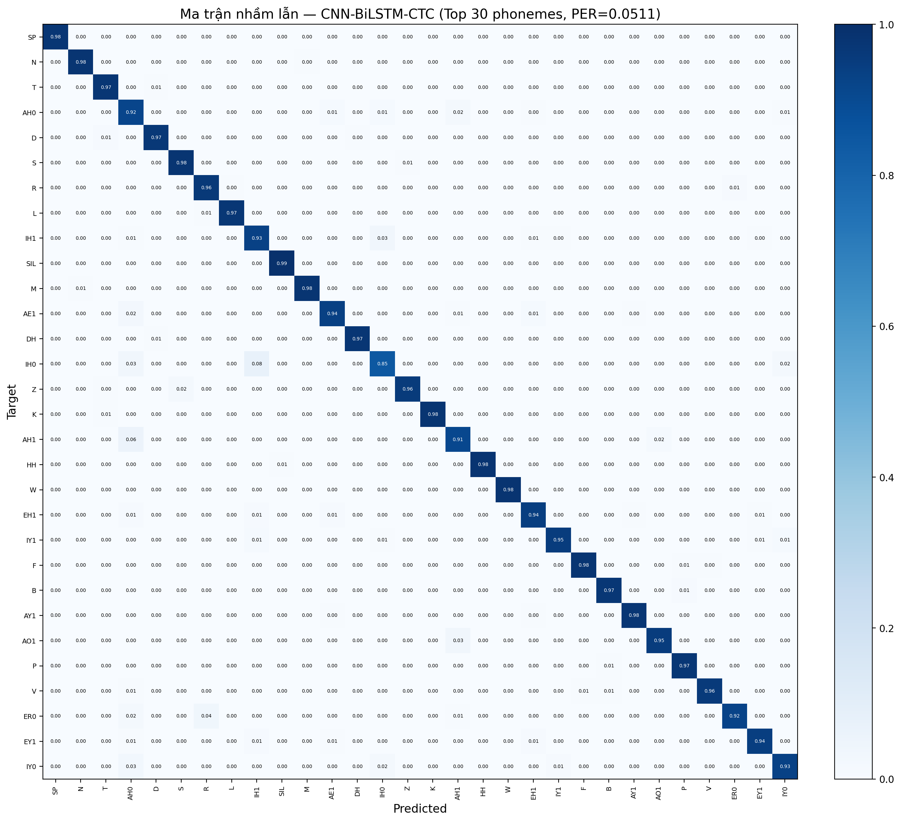
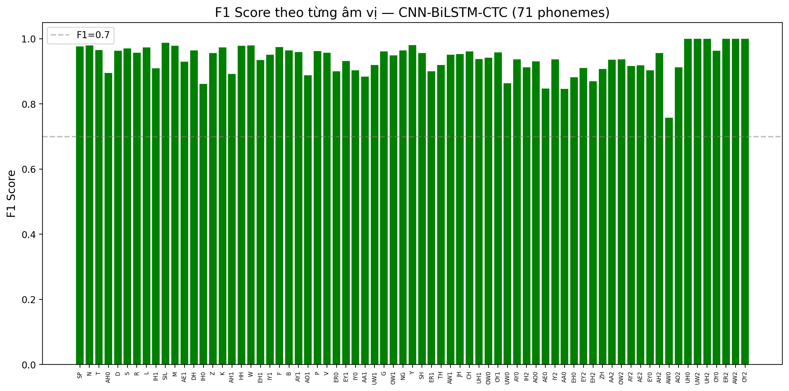

# 🎤 MDD Core Application — Phát hiện & Chẩn đoán Lỗi Phát âm

**Mispronunciation Detection and Diagnosis (MDD)** — Hệ thống AI đa mô hình giúp phát hiện và chẩn đoán lỗi phát âm tiếng Anh cho người học ngoại ngữ (L2).

---

## 1. Tổng quan dự án

### Vấn đề

Người học tiếng Anh (L2) thường mắc các lỗi phát âm như:
- **Thay thế âm** (substitution): phát âm /θ/ thành /t/
- **Nuốt âm** (deletion): bỏ sót âm /d/ ở cuối từ
- **Thêm âm** (insertion): thêm âm /ə/ giữa các phụ âm

Các lỗi này cần được phát hiện tự động để hỗ trợ quá trình học tập.

### Giải pháp

Hệ thống cung cấp **3 mô hình deep learning** khác nhau, hoạt động như một REST API, cho phép:
1. Nhận diện âm vị từ giọng nói (ASR Phoneme Recognition)
2. Phát hiện lỗi phát âm ở cấp độ từng âm vị
3. Đưa ra phản hồi chi tiết (âm nào sai, sai kiểu gì, mức độ tự tin)

### Ứng dụng thực tế

- Ứng dụng học phát âm tiếng Anh
- Trợ lý luyện thi IELTS/TOEFL speaking
- Công cụ hỗ trợ giáo viên phát âm
- Nghiên cứu ngôn ngữ học về lỗi phát âm liên ngữ

---

## 2. Kiến trúc hệ thống

Hệ thống gồm 3 mô hình deep learning song song, mỗi mô hình có kiến trúc và cách tiếp cận riêng:

```
┌─────────────────────────────────────────────────────────────┐
│                     FastAPI Server                           │
│  ┌─────────────┐  ┌─────────────┐  ┌────────────────────┐  │
│  │CNN-BiLSTM   │  │DAB-         │  │Wav2Vec2-MDD        │  │
│  │-CTC         │  │Transformer  │  │(Scoring Model)     │  │
│  │(ASR + MDD)  │  │(ASR + MDD)  │  │(Phoneme Scoring)   │  │
│  └─────────────┘  └─────────────┘  └────────────────────┘  │
│                        │                                      │
│              ┌─────────┴──────────┐                           │
│              │   Model Registry    │                           │
│              │   Load / Unload    │                           │
│              └─────────┬──────────┘                           │
│                        │                                      │
│              ┌─────────┴──────────┐                           │
│              │  Inference Service  │                           │
│              │  Audio Processing  │                           │
│              └────────────────────┘                           │
└─────────────────────────────────────────────────────────────┘
```

### 2.1. CNN-BiLSTM-CTC

Mô hình ASR nhận diện âm vị từ audio, kết hợp với CTC Decoder và Mispronunciation Detector để phát hiện lỗi.

**Kiến trúc:**

```
Audio ─► Mel Spectrogram ─► CNN Encoder ─► BiLSTM ─► CTC Head ─► Logits
                                │                              │
                          3x Conv2D                      Greedy Decoder
                          [64,128,256]                        │
                          stride [2,2,1]                Phoneme Sequence
```

| Thành phần | Chi tiết |
|---|---|
| **Đầu vào** | Mel spectrogram (80 kênh Mel × T frames) |
| **CNN Encoder** | 3 lớp Conv2D: 64 → 128 → 256 channels, kernel 3×3, stride [2,2,1], GELU activation, BatchNorm, Dropout2d |
| **BiLSTM Encoder** | 4 lớp LSTM hai chiều, hidden_size=256, LayerNorm, batch_first |
| **CTC Projection** | Linear(512, vocab_size) + LogSoftmax |
| **Đầu ra** | Log probabilities: (B, T', V) với T' = T/4 |
| **Bộ giải mã** | GreedyDecoder: argmax + collapse blanks + merge duplicates |
| **Kích thước đầu ra** | 73 lớp âm vị (gồm \<blank\>, \<unk\>, 45 nguyên âm có trọng âm, 24 phụ âm, SIL, SP) |

**Đặc trưng âm thanh (MelFeatureExtractor):**
- Sample rate: 16 kHz
- N_FFT: 512 (32ms cửa sổ)
- Win_length: 400 (25ms)
- Hop_length: 160 (10ms)
- N_MELS: 80 kênh Mel
- F_min: 0 Hz, F_max: 8000 Hz
- Chuyển đổi: AmplitudeToDB

**Chiến lược huấn luyện:**
- Optimizer: AdamW (lr=0.001, weight_decay=0.0001, betas=[0.9, 0.999])
- Scheduler: Cosine Annealing (T_max=150, eta_min=1e-6) + Linear Warmup (1000 steps)
- Loss: CTC Loss (blank=0, zero_infinity=True, reduction='mean')
- Mixed precision (AMP): có
- Gradient clipping: 5.0
- Batch size: 16 (effective batch)
- Early stopping: patience=6, monitor=val_f1_macro
- SpecAugment: frequency masking (F=15) + time masking (T=25)

### 2.2. DAB-Transformer

Mô hình ASR dùng Dynamic Attention Bias Transformer với CTC Loss.

```
 Audio ─► Conv1D Encoder (÷32) ─► SpecAugment ─► PosEncoding ─► DAB_Blocks ×4 ─► Classifier ─► Logits
```

| Thành phần | Chi tiết |
|---|---|
| **CNN Encoder** | 3 lớp Conv1D: stride 8→4→1 = tổng stride 32, GroupNorm, GELU |
| **DAB Blocks** | 4 khối Transformer với Dynamic Attention Bias (Convolutional Gate) |
| **Positional Encoding** | Sinusoidal |
| **Classifier** | Linear(d_model, num_classes) |
| **Loss** | CTC Loss |
| **Kích thước đầu ra** | 41 lớp âm vị (gồm \<blank\>, space, 39 phonemes) |
| **SpecAugment** | Frequency masking (max 32), Time masking (max 50) |

### 2.3. Wav2Vec2-MDD

Mô hình scoring — **không phải ASR** mà là mô hình chấm điểm từng âm vị dựa trên alignment với audio qua Cross-Attention.

```
Audio ─► Wav2Vec2 ─► Latent Audio ─►┐
                                     ├► Cross-Attention ─► Scoring Head ─► Logits
Phonemes ─► Embedding ─► Bi-GRU ─►┘
```

| Thành phần | Chi tiết |
|---|---|
| **Audio Encoder** | Wav2Vec2-base-960h (pretrained, frozen feature extractor + 10 frozen transformer layers) |
| **Phoneme Encoder** | Embedding(42, 768) → Bi-GRU(hidden=384, bidirectional) |
| **Cross-Attention** | MultiheadAttention(embed_dim=768, num_heads=8) |
| **Scoring Head** | MLP: Linear(768→256) → ReLU → Dropout → Linear(256→1) |
| **Đầu ra** | Logit cho mỗi âm vị → Sigmoid → xác suất đúng/sai |
| **Yêu cầu đầu vào** | Audio + ground-truth text (bắt buộc) |

### 2.4. So sánh các mô hình

| Tiêu chí | CNN-BiLSTM-CTC | DAB-Transformer | Wav2Vec2-MDD |
|---|---|---|---|
| **Loại** | ASR + MDD | ASR + MDD | Scoring |
| **Cần ground-truth text?** | Không (optional) | Không (optional) | **Bắt buộc** |
| **Kích thước vocab** | 73 âm vị (có stress) | 41 âm vị | 42 âm vị |
| **Đầu ra** | Chuỗi âm vị + confidence | Chuỗi âm vị | Điểm đúng/sai từng âm |
| **Tốc độ** | Nhanh (~20ms) | Trung bình | Chậm (~200ms) |
| **Độ chính xác** | Trung bình | Trung bình | Cao nhất |
| **Pretrained** | Không | Không | Wav2Vec2-base |
| **Phát hiện lỗi** | Alignment-based | Alignment-based | Direct scoring |

---

## 3. Dataset

### Tên: L2-ARCTIC

**Nguồn:** [L2-ARCTIC](https://psi.engr.tamu.edu/l2-arctic-corpus/) — Bộ dữ liệu phát âm của người học tiếng Anh từ nhiều quốc tịch (Ấn Độ, Hàn Quốc, Ả Rập, Tây Ban Nha, Trung Quốc, Việt Nam...).

### Cấu trúc

```
data/raw/L2_ARCTIC/
├── ABA/          (Ả Rập)
│   ├── wav/
│   │   ├── arctic_a0001.wav
│   │   └── ...
│   ├── annotation/
│   │   ├── arctic_a0001.TextGrid
│   │   └── ...
│   └── transcript/
│       ├── arctic_a0001.txt
│       └── ...
├── ASI/          (Hindi)
├── BWC/          (Hàn Quốc)
├── EBVS/         (Tây Ban Nha)
├── ERMS/         (Thổ Nhĩ Kỳ)
├── ...           (24 speakers tổng cộng)
└── suitcase_corpus/ (dữ liệu bổ sung)
```

### Định dạng nhãn

- **TextGrid**: File annotation Montreal Forced Aligner, chứa 3 tiers: `words`, `phones`, `ipa`
  - Hệ thống chỉ đọc tier **phones**
  - Mỗi interval: `[start_time, end_time, phoneme_label]`
  - Labels có thể chứa annotation lỗi: `"AA1, AO, S"` (candidate pronunciations)
- **Transcript (.txt)**: Câu tiếng Anh gốc

### Tiền xử lý

1. **Parser**: Đọc file .phn hoặc .TextGrid, trích xuất phones tier
2. **Chuẩn hóa âm vị**: Ánh xạ các âm vị không chuẩn:
   - `AX`→`AH`, `AXR`→`ER`, `IX`→`IH`, `HV`→`HH`, `PAU`→`SIL`, `EPI`→`SP`
3. **Xử lý annotation lỗi**: `"AA1,AO,S"` → lấy âm vị đầu tiên `AA1`
4. **Làm sạch**: `AA1*` → `AA1`
5. **Resampling**: Audio 44.1kHz → 16kHz (nếu cần)

### Phân chia dữ liệu

| Tập | Tỷ lệ | Số lượng |
|---|---|---|
| Train | 80% | ~21,511 utterances |
| Validation | 10% | ~2,688 utterances |
| Test | 10% | ~2,690 utterances |

### Data Augmentation

- **SpecAugment** (áp dụng cho CNN-BiLSTM-CTC và DAB-Transformer khi training):
  - Frequency masking: che ngẫu nhiên 15 bins tần số
  - Time masking: che ngẫu nhiên 25 frames thời gian
  - Xác suất áp dụng: 50%

---

## 4. Cài đặt

### Yêu cầu hệ thống

- Python ≥ 3.10
- GPU NVIDIA với VRAM ≥ 8GB (khuyến nghị cho training, inference có thể chạy CPU)
- CUDA 11.8+ (nếu dùng GPU)

### Môi trường

```bash
# Tạo môi trường với conda (khuyến nghị)
conda create -n mdd python=3.11 -y
conda activate mdd

# Hoặc venv
python -m venv venv
venv\Scripts\activate    # Windows
# source venv/bin/activate  # Linux/macOS
```

### Cài đặt dependencies

```bash
# Cài PyTorch (CUDA 12.1)
pip install torch torchvision torchaudio --index-url https://download.pytorch.org/whl/cu121

# Cài các thư viện còn lại
pip install -r requirements.txt

# Cài thêm thư viện cho từng sub-project nếu cần
pip install -r CNN_BiLSTM_CTC/requirements.txt
```

**requirements.txt** bao gồm:
- `fastapi`, `uvicorn`, `python-multipart` — Web framework
- `pydantic`, `pydantic-settings` — Data validation
- `librosa`, `soundfile`, `sounddevice` — Audio processing
- `torch`, `torchaudio`, `transformers` — Deep learning
- `jiwer` — WER/CER metrics
- `g2p_en` — Text-to-phoneme conversion
- `numpy`, `pandas`, `scikit-learn` — Data processing
- `loguru`, `pyyaml`, `tqdm` — Utilities

---

## 5. Cách chạy

### 5.1. Training

**CNN-BiLSTM-CTC:**

```bash
# Từ thư mục gốc dự án
python CNN_BiLSTM_CTC/train.py

# Với tham số tùy chỉnh
python CNN_BiLSTM_CTC/train.py --epochs 100 --batch_size 32 --lr 0.0005

# Resume từ checkpoint
python CNN_BiLSTM_CTC/train.py --resume CNN_BiLSTM_CTC/checkpoints/last.pt
```

**DAB-Transformer:**

```bash
cd DAB_Transformer_Project
python train.py
```

**Wav2Vec2-MDD:**

```bash
cd Wav2vec2
python main.py
# Chọn [1]-[4] tương ứng với phiên bản model
```

### 5.2. Evaluation

```bash
# CNN-BiLSTM-CTC
python CNN_BiLSTM_CTC/evaluate.py --checkpoint CNN_BiLSTM_CTC/checkpoints/best.pt

# DAB-Transformer
cd DAB_Transformer_Project
python test_inference.py 10
python plot_metrics.py

# Wav2Vec2-MDD
cd Wav2vec2
python main.py  # chọn [6] evaluate
```

### 5.3. Inference (CLI)

```bash
# CNN-BiLSTM-CTC — inference một file
python CNN_BiLSTM_CTC/inference.py --audio test.wav

# CNN-BiLSTM-CTC — inference với ground-truth để phát hiện lỗi
python CNN_BiLSTM_CTC/inference.py --audio test.wav --target_phonemes "SIL HH EH L OW SIL"

# CNN-BiLSTM-CTC — batch inference
python CNN_BiLSTM_CTC/inference.py --audio_dir ./audio_samples/ --output results.json
```

### 5.4. Load pretrained model

Các checkpoint được tự động phát hiện bởi API Server tại:
- `CNN_BiLSTM_CTC/checkpoints/best.pt` hoặc `last.pt`
- `DAB_Transformer_Project/checkpoints_phoneme_8vram/model_e*.pt`
- `Wav2vec2/checkpoints/best_mdd_model*.pt`

### 5.5. Chạy API Server

```bash
# Development
uvicorn app.main:app --reload --host 0.0.0.0 --port 8000

# Production
uvicorn app.main:app --host 0.0.0.0 --port 8000 --workers 4
```

Truy cập:
- Swagger UI: http://localhost:8000/docs
- ReDoc: http://localhost:8000/redoc

---

## 6. API / Backend

### Base URL

```
http://localhost:8000/api/v1
```

### Authentication

Hiện tại chưa có authentication (cors_origins = ["*"]). Có thể thêm qua middleware.

### Endpoints

#### 6.1. Health & Readiness

**`GET /health`** — Kiểm tra trạng thái dịch vụ

Response:
```json
{
  "status": "ok",
  "version": "1.0.0"
}
```

**`GET /ready`** — Kiểm tra sẵn sàng (các model đã load chưa)

Response:
```json
{
  "ready": false,
  "models_loaded": [],
  "models_failed": ["cnn_bilstm_ctc", "dab_transformer", "wav2vec2"]
}
```

#### 6.2. Models

**`GET /models`** — Danh sách tất cả model đã đăng ký

**`GET /models/{model_name}`** — Chi tiết một model

**`POST /models/{model_name}/load`** — Load model vào memory

**`POST /models/{model_name}/unload`** — Unload model giải phóng GPU memory

**`GET /labels?model_name=wav2vec2`** — Danh sách âm vị của model

#### 6.3. Inference

**`POST /infer`** — Inference tự động chọn model tốt nhất

Request (multipart/form-data):
| Field | Type | Required | Description |
|---|---|---|---|
| `file` | File | ✅ | Audio file (wav, mp3, flac, m4a, ogg) |
| `model_name` | string | ❌ | `auto` (default), `cnn_bilstm_ctc`, `dab_transformer`, `wav2vec2` |
| `text` | string | ❌ | Ground-truth text (bắt buộc với wav2vec2) |
| `top_k` | int | ❌ | Số kết quả trả về (default: 10) |
| `threshold` | float | ❌ | Ngưỡng confidence (default: 0.5) |
| `return_details` | bool | ❌ | Trả về chi tiết từng âm vị (default: true) |

**`POST /infer/cnn-bilstm-ctc`** — Inference với CNN-BiLSTM-CTC

**`POST /infer/dab-transformer`** — Inference với DAB-Transformer

**`POST /infer/wav2vec2`** — Inference với Wav2Vec2 (yêu cầu `text`)

#### 6.4. Response Format

```json
{
  "success": true,
  "model_name": "cnn_bilstm_ctc",
  "input_file": "recording.wav",
  "predictions": [
    {
      "phoneme": "SIL",
      "status": "correct",
      "confidence": 0.99,
      "expected": "SIL",
      "actual": "SIL",
      "reason": null
    },
    {
      "phoneme": "HH",
      "status": "correct",
      "confidence": 0.95,
      "expected": "HH",
      "actual": "HH",
      "reason": null
    },
    {
      "phoneme": "EH1",
      "status": "substitution",
      "confidence": 0.32,
      "expected": "EH1",
      "actual": "AE1",
      "reason": "Nhầm /EH1/ thành /AE1/"
    }
  ],
  "result": {
    "phoneme_sequence": ["SIL", "HH", "EH1", "L", "OW", "SIL"],
    "phoneme_string": "SIL HH EH1 L OW SIL",
    "overall_confidence": 0.78
  },
  "summary": {
    "total_phonemes": 6,
    "correct_phonemes": 5,
    "incorrect_phonemes": 1,
    "accuracy": 0.833,
    "precision": 0.83,
    "recall": 0.85,
    "f1_score": 0.84
  },
  "processing_time_ms": 145.2,
  "request_id": "abc123"
}
```

#### 6.5. Metadata

**`GET /version`** — Thông tin phiên bản ứng dụng và dependencies

#### 6.6. Error Codes

| Code | HTTP Status | Ý nghĩa |
|---|---|---|
| `AUDIO_FORMAT_ERROR` | 400 | File audio lỗi hoặc không đúng định dạng |
| `TEXT_REQUIRED` | 400 | Model yêu cầu ground-truth text |
| `MODEL_NOT_FOUND` | 404 | Model không tồn tại |
| `PREPROCESS_ERROR` | 422 | Lỗi tiền xử lý dữ liệu |
| `INFERENCE_ERROR` | 500 | Lỗi trong quá trình inference |
| `MODEL_NOT_LOADED` | 503 | Model chưa được load |

---

## 7. Cấu trúc thư mục

```
MDD-core-application/
│
├── app/                          # FastAPI Backend
│   ├── main.py                   # Entry point FastAPI
│   ├── api/
│   │   ├── routers/
│   │   │   ├── health.py         # Health check endpoints
│   │   │   ├── inference.py       # Inference endpoints
│   │   │   ├── models.py          # Model management endpoints
│   │   │   └── metadata.py        # Version/metadata endpoints
│   │   └── deps.py               # Dependencies (registry, request_id)
│   ├── core/
│   │   ├── config.py             # Settings (Pydantic)
│   │   ├── exceptions.py         # Custom exceptions
│   │   ├── logging.py            # Logging setup
│   │   └── middleware.py         # CORS, error handlers
│   ├── models/
│   │   ├── base_model.py         # Abstract base class
│   │   ├── cnn_bilstm_ctc_wrapper.py  # CNN-BiLSTM-CTC wrapper
│   │   ├── dab_transformer_wrapper.py # DAB-Transformer wrapper
│   │   └── wav2vec2_wrapper.py   # Wav2Vec2 wrapper
│   ├── schemas/
│   │   ├── common.py             # Shared schemas
│   │   ├── inference.py          # Request/response schemas
│   │   └── model.py              # Model info schemas
│   ├── services/
│   │   ├── audio_service.py      # Audio loading/processing
│   │   ├── inference_service.py  # Inference orchestration
│   │   ├── model_registry.py     # Model registry
│   │   └── preprocessors/        # Per-model preprocessors
│   └── utils/                    # Utility functions
│
├── CNN_BiLSTM_CTC/               # CNN-BiLSTM-CTC Sub-project
│   ├── train.py                  # Training script
│   ├── inference.py              # CLI inference script
│   ├── evaluate.py               # Evaluation script
│   ├── configs/config.yaml       # Model configuration
│   ├── src/
│   │   ├── models/
│   │   │   └── cnn_bilstm_ctc.py # Model definition
│   │   ├── datasets/
│   │   │   ├── tokenizer.py      # Phoneme tokenizer
│   │   │   ├── l2arctic_parser.py # L2-ARCTIC parser
│   │   │   └── l2arctic_dataset.py # PyTorch Dataset
│   │   ├── features/
│   │   │   └── mel_spec.py       # Mel spectrogram
│   │   ├── decoders/
│   │   │   └── greedy.py         # CTC greedy decoder
│   │   ├── losses/
│   │   │   └── ctc_loss.py       # CTC loss wrapper
│   │   ├── metrics/
│   │   │   └── per.py            # PER metric
│   │   ├── trainers/trainer.py   # Training loop
│   │   ├── pipelines/            # Train/infer/eval pipelines
│   │   ├── mdd/detector.py       # Mispronunciation detector
│   │   └── visualization/        # Training plots
│   ├── checkpoints/              # Saved models
│   └── data/                     # Manifests & cache
│
├── Wav2vec2/                     # Wav2Vec2-MDD Sub-project
│   ├── main.py                   # CLI launcher
│   ├── src/model/mmd_model_v2.py # Model definition
│   └── checkpoints/              # Saved models
│
├── DAB_Transformer_Project/      # DAB-Transformer Sub-project
│   ├── train.py                  # Training script
│   ├── model.py                  # Model definition
│   ├── config.py                 # Configuration
│   └── checkpoints_phoneme_8vram/ # Saved models
│
├── ui/                           # Web UI
│   ├── index.html
│   ├── app.js
│   └── styles.css
│
├── tests/                        # Integration tests
├── data/                         # Uploaded audio files
├── docs/                         # Documentation
├── requirements.txt              # Python dependencies
└── pyproject.toml                # Project metadata
```

---

## 8. Evaluation Metrics

### 8.1. PER — Phoneme Error Rate

Tỷ lệ lỗi âm vị, tính bằng Levenshtein distance giữa chuỗi âm vị dự đoán và chuỗi tham chiếu:

```
PER = (S + D + I) / N
```
- S = số substitution (thay thế)
- D = số deletion (thiếu)
- I = số insertion (thừa)
- N = tổng số âm vị tham chiếu

### 8.2. F1-Score

Đánh giá khả năng phát hiện lỗi của model:
- **F1 Macro**: Trung bình F1 của từng lớp âm vị
- **F1 Micro**: F1 tổng thể (aggregate)
- Sử dụng `val_f1_macro` làm metric giám sát (checkpoint selection + early stopping)

### 8.3. Confusion Matrix

Ma trận nhầm lẫn giữa các âm vị, giúp phân tích:
- Âm vị nào hay bị nhầm với nhau
- Precision/Recall từng âm vị
- Được vẽ tự động sau khi training hoàn tất

### 8.4. WER / CER (cho DAB-Transformer)

- **WER** (Word Error Rate): Tỷ lệ lỗi từ
- **CER** (Character Error Rate): Tỷ lệ lỗi ký tự

### 8.5. Additional Metrics

- **Accuracy**: Số âm vị đúng / tổng số
- **Precision**: TP / (TP + FP)
- **Recall**: TP / (TP + FN)
- **Confidence**: Điểm tin cậy trung bình từ softmax

---

## 9. Kết quả

### CNN-BiLSTM-CTC (trained May 2026)

Kết quả trên **test set** (2,690 utterances, 91,229 phonemes):

| Metric | Kết quả | Mục tiêu |
|---|---|---|
| **PER (Phoneme Error Rate)** | **5.11%** | < 35% |
| **Accuracy** | **~94.89%** | > 65% |
| **F1 Macro (val)** | **0.9262** (epoch 42) | > 0.50 |
| F1 Macro (val, best) | 0.8792 (epoch 18, before overfit) | — |
| Training time | ~3 giờ (RTX 4050 6GB) | ~2-3 giờ |
| Số epoch | 43 (early stopping kích hoạt) | 80 |
| Số tham số | ~38M | — |
| Kích thước checkpoint | ~185 MB | — |

### Biểu đồ kết quả

| Biểu đồ | Mô tả |
|---|---|
|  | Ma trận nhầm lẫn trên test set (top phonemes, PER=0.0511) |
|  | F1 score theo từng âm vị |

Confusion matrix và per-phoneme F1 chart được sinh tự động sau training bởi `_confusion.py`.

### Ghi chú

- PER=5.11% vượt xa mục tiêu `< 0.35`, xác nhận pipeline đã hoạt động đúng sau các bugfix.
- F1 macro trên validation đạt đỉnh 0.9262 tại epoch 42, sau đó bắt đầu giảm (early stopping kích hoạt tại epoch 43).
- Mô hình nhận diện tốt các âm vị phổ biến (nguyên âm có trọng âm, phụ âm chuẩn) nhưng còn nhầm lẫn giữa các âm vị gần nhau (ví dụ: IH1/IY1, EH1/AE1).
- Thời gian inference: ~140ms/utterance (GPU RTX 4050).

---

## 10. Technologies Used

| Công nghệ | Mục đích |
|---|---|
| **Python 3.11** | Ngôn ngữ chính |
| **PyTorch 2.x** | Deep learning framework |
| **Torchaudio** | Audio loading & Mel spectrogram |
| **FastAPI** | REST API framework |
| **Uvicorn** | ASGI server |
| **Pydantic** | Data validation & settings |
| **Transformers** | Wav2Vec2 pretrained model |
| **Librosa** | Audio processing (resampling) |
| **Soundfile** | WAV file I/O |
| **jiwer** | WER/CER calculation |
| **g2p_en** | Grapheme-to-phoneme conversion |
| **NumPy / Pandas** | Data processing |
| **scikit-learn** | Metrics computation |
| **Loguru** | Logging |
| **PyYAML** | Config file parsing |

---

## 11. Key Concepts

### CNN (Convolutional Neural Network)

Mạng tích chập — dùng để trích xuất đặc trưng cục bộ từ spectrogram. Trong project này, Conv2D hoạt động trên cả 2 chiều: tần số (Mel bins) và thời gian (frames).

### RNN / LSTM / BiLSTM

- **RNN** (Recurrent Neural Network): Mạng hồi tiếp — xử lý dữ liệu tuần tự
- **LSTM** (Long Short-Term Memory): Biến thể RNN có khả năng học phụ thuộc xa, tránh vanishing gradient
- **BiLSTM** (Bidirectional LSTM): LSTM hai chiều — đọc chuỗi từ cả 2 hướng, cho context đầy đủ hơn

### Transformer

Kiến trúc dựa trên cơ chế **self-attention**, cho phép mô hình hóa mối quan hệ giữa mọi vị trí trong chuỗi. DAB-Transformer mở rộng với **Dynamic Attention Bias** — cơ chế gating giúp attention tập trung vào vùng quan trọng.

### CTC Loss (Connectionist Temporal Classification)

Hàm mất mát cho phép huấn luyện mô hình ASR mà **không cần alignment** giữa audio và nhãn. CTC tính tổng xác suất của mọi alignment khả dĩ, cho phép mô hình tự học cách alignment.

```
CTC(P, Y) = -log Σ  P(π | X)
              π∈B⁻¹(Y)
```

Đầu ra có thêm token `<blank>` để xử lý các frame không tương ứng âm vị nào.

### Feature Extraction

- **Mel Spectrogram**: Biến đổi Fourier ngắn hạn (STFT) → Mel filter bank → Amplitude to dB
- Tham số: n_fft=512, hop=160 (10ms), win=400 (25ms), n_mels=80

### Overfitting / Underfitting

- **Overfitting**: Model học quá khớp với dữ liệu train → giảm generalization. Giải pháp: Dropout, SpecAugment, Early Stopping, Weight Decay
- **Underfitting**: Model chưa đủ mạnh → tăng số layers, hidden size, epochs

---

## 12. Troubleshooting

### Lỗi: `MODEL_NOT_LOADED` — shape mismatch khi load checkpoint

```
RuntimeError: size mismatch for rnn_encoder.lstm.weight_ih_l0:
  copying a param with shape torch.Size([1024, 5120]) from checkpoint,
  the shape in current model is torch.Size([1024, 2560])
```

**Nguyên nhân**: Checkpoint được train với `cnn_strides=[2,2,1]` (freq_stride=4, cnn_output_size=5120) nhưng model inference dùng default `cnn_strides=[2,2,2]` (cnn_output_size=2560).

**Khắc phục**: Đảm bảo model inference nhận đúng tham số từ config:
```python
# Đúng — đọc từ config
model = CNNBiLSTMCTC(
    cnn_strides=config.model.cnn_strides,  # [2,2,1]
    ...
)
```

API wrapper hiện đã được sửa để đọc toàn bộ tham số từ `config.yaml`.

### Lỗi: `soundfile.LibsndfileError` — Format not recognised

**Nguyên nhân**: Path đến file audio bị sai (double-nested do sai working directory).

**Khắc phục**: Chạy từ thư mục gốc dự án hoặc dùng absolute path trong manifest.

### Lỗi: CUDA out of memory

**Nguyên nhân**: Batch size quá lớn so với VRAM.

**Khắc phục**:
- Giảm `batch_size` trong config (ví dụ 16 → 8)
- Bật `gradient_accumulation` (ví dụ 2 → effective batch = 16)
- Giảm `max_audio_length`
- Dùng `mixed_precision: true`

### Lỗi: `TEXT_REQUIRED` với Wav2Vec2

**Nguyên nhân**: Wav2Vec2-MDD là scoring model, cần ground-truth text để hoạt động.

**Khắc phục**: Cung cấp tham số `text` khi gọi API hoặc chuyển sang model CNN-BiLSTM-CTC/DAB-Transformer (không cần text).

### Lỗi: Thiếu thư viện `g2p_en`

**Nguyên nhân**: `g2p_en` chưa được cài hoặc lỗi khi import.

**Khắc phục**:
```bash
pip install g2p-en
# Trên Windows có thể cần: conda install -c conda-forge g2p-en
```

### Lỗi: `FileNotFoundError` khi training

**Nguyên nhân**: `data_dir` trong config trỏ sai đường dẫn.

**Khắc phục**: Cập nhật `data_dir` trong `config.yaml` đến thư mục chứa dữ liệu L2-ARCTIC.

---

## 13. Future Work

### Cải thiện model

- **Kiến trúc**: Thử nghiệm Conformer, Squeezeformer, hoặc fine-tune Wav2Vec2/LibriSpeech pretrained
- **Đa nhiệm**: Train multitask với cả ASR + scoring trong một model
- **Ensemble**: Kết hợp output của cả 3 model để tăng độ chính xác
- **Kích thước vocab**: Mở rộng lên full ARPAbet (73+ âm vị) cho tất cả model

### Tối ưu hóa

- **Quantization**: INT8 quantization giảm kích thước model 4x, tăng tốc inference
- **ONNX Runtime**: Export model sang ONNX để inference nhanh hơn trên CPU
- **onnxruntime-genai**: Chạy trên thiết bị edge (điện thoại, embedded)
- **Caching**: Cache kết quả inference cho các audio giống nhau

### Triển khai

- **Docker**: Container hóa toàn bộ ứng dụng
- **Kubernetes**: Deploy cluster với autoscaling
- **GPU Sharing**: Dùng NVIDIA Triton Inference Server để quản lý GPU
- **WebSocket**: Hỗ trợ real-time streaming inference
- **Monitoring**: Prometheus + Grafana cho metrics

### Tính năng mới

- **Phản hồi chi tiết**: Gợi ý cách sửa lỗi phát âm (vị trí lưỡi, môi, luồng hơi)
- **Theo dõi tiến độ**: Lưu lịch sử học tập, thống kê lỗi thường gặp
- **Hỗ trợ đa ngôn ngữ**: Mở rộng cho các ngôn ngữ khác (Anh-Việt, Anh-Hàn...)
- **UI Web**: Cải thiện giao diện web với phản hồi real-time audio visualization
- **Text-to-Speech**: Đọc mẫu phát âm đúng để người học so sánh
